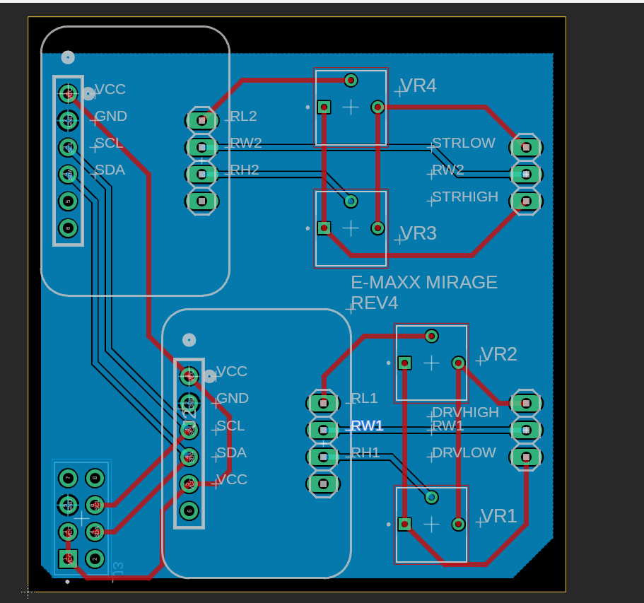

# Steering Wheel Code Changelog

# 4/28/2024
 Before today steering wheel code just reads inputs and displays the values in the terminal. After work today the steering wheel code now can interrperet data from the wheel and correclty assign a value to a potentiometer. There are 3 speed levels 25 percent 50 percent and full speed. The program defaults to 25 percent. The user can use the left paddle to set to 25 right to 50 and xbox button to full speed. The steering can also be changed by pressing a for normal steering. b for 50 percent steering meaning the user only has to turn the wheel 50 percent for full steering effect and y for 25 percent steering. Currently these values are printed to the terminal and are not actually transmitted through i2c yet.

 # 4/29/2024
 Today I implemented the I2C code into the steering test code. You can now control the transmitter using the steering wheel. There is still some fiddling with the transmitter to get it to work properly. The car still moves too quickly and will need more adjusting. This was tested using a new wiring method of using some 4 100kohm potentiometers to limit voltage. This did help with granularity. 

 I also began working on a new board schematic that uses this new design and also will have headers to directly interface with the gpio pins on the raspberry pi 3. Will continue to work on this throughtout the week.

 # 5/3/2024
 Finalized board desing. Sent board design to PCB way waiting on quote and ETA for new board. I will also add the 12v to 5v power supply so that the raspberry pi 3 can be powered using the same power cord that the transmitter is using.

 update the power supply works now the transmitter and raspberry pi share a power supply

 # 5/7/2024
 Turns out PCBway is going to be expensive and slow to provide our board. Made the decision to order 3 boards from OSH Park and solder ourselves. Should be possible to use components already obtained but I may purchse some potentiometers. Our PCB should be After Dark so they will look like this

   
  
  which is sick. Later this week I plan on doing some tests with radio interference. I also started the Bill of materials so that we can keep track of expenses.

  # 5/8/2024
  Today I spent hours trying to figure how how to control the force feedback on the steering wheel. Turns out I needed to update the linux kernal. Once updated I was finally able to use a command to move the wheel.

  https://www.kernel.org/doc/html/v4.13/input/ff.html

  This website supplies documentation on how to write a program to control the rumble. I will write the program later but now I have confirmation that force feedback will work. I was able to supply constant force as well as rumble and a spring like motion which pushes the wheel back to its resting state.

  # 5/13/2024
  Started writing force feedback code. My test code is in ForceFeedbackTest.c. Currently the program should start force feedback and enable a spring effect. I do not know if it currently works as I have not had time to run to the lab yet but I will try to get to the lab before our group meets on wednesday.

  Looks like I did have time to make into the lab later in the day. I combined the code for both steering and force feedback into a new file called SteerandForce.c. This new program should maintain all the funcitonality of steering before with the added force feedback. The code still needs to be cleaned up a lot. The force feedback functionality consists of 4 different effects. Effect 0 is a spring effect which plays whenever the car is moving and will change in intensity depending on the speed of the car. I will need to tweak this as it is not perfect yet. Effect 1 is a damping effect wich is active when the car is still. Effect 2 is a light rumble which plays when the user selects the second speed mode. Effect 3 is a strong rumble which plays when the user selects the max speed mode. Values will need to be adjusted but baseline functionality is basically complete. I plan on showing the team as well as Ken on wednesday.

  # 5/23/2024
  Started refining driving and have an ETA on new board. I plan on working on refining the driving experience as well as soldering the new board next week. 

  # 5/28/2024
  Sad day board blew up again. The fire was cool though. It was discouraging and sad that the third design does not work. I believe it was shorted between SDA and GND. However we did continuity tests and it should have worked. Kyla is going to attempt to solder another one to see if we can get it to work. I will work on designing a simplified new version 4. This one will be super simple and will basically act as a breadboard that models our other circuit exactly. 

  # 5/29/2024
  I have finished designing a super simple revision 4. This design will simply connect two of the adafruit breakout boards with 4 extra potentiometers. This was the simplest design I could come up with as it uses all known working parts as well as models the circuit on our working breadboard exactly. I am currently waiting for other people to check my work and will hopefully have it ordered by the end of the week. Fingers crossed this is the last board we need to make.
  

  # 5/30/2024
Just ordered Rev4 after making some slight changes to the design. I ordered it in purple to hopefully get the boards quicker.

# 6/3/2024
Began work on 3d design. So far I have just an outline of the back of the transmitter. I will need more measurements to complete the design.

# 6/4/2024
Kyla and I tried another v3 and got some success. It worked for a short period of time but quickly stopped working. We are going to start 3d designing the enclosure while we wait for v4 to come in the mail. We plan on having designs in two weeks.