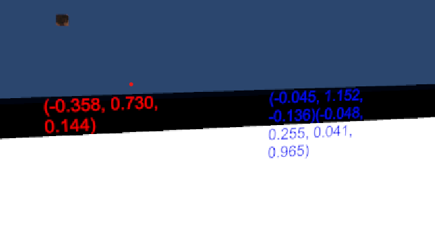

## Arduino Setup
//followed Murphy's steps and notes to get it set up and these are the settings.

//connect using putty\
Hostname: hdr3.local\
login as: hdr\
password: 1234

//The hotspot starts on reboot!!!

//Hotspot\
SSID= Mikes Pi\
wpa passphrase=MyP!12345

//This starts the hotspot if its not already running\
sudo nmcli device wifi hotspot ssid 'Mikes Pi' password 'MyP!12345'

## Unity Project
I am using an old project from another class for the initial setup, because I didn't want to have to configure. It used the XR plugin and the oculus XR to make it easy to test.

For the oculus its an meta quest 2 that is running through airlink with the computer and it has been possible to pull out various values from the headset and display them on a canvas on the screen. 

The values in red are the position data of the left controller. The blue values are first the positin values of the headset and second the rotation values in the headset.

# Helpful Links
Get sensor Values out of headset - https://forum.unity.com/threads/how-to-access-sensor-values-and-display-them.1026583/

Airlink with oculus and unity - https://www.youtube.com/watch?v=dJJ0IFcJEW0&ab_channel=DanielStringer
